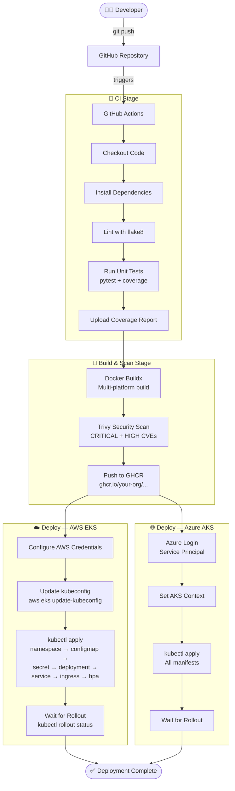
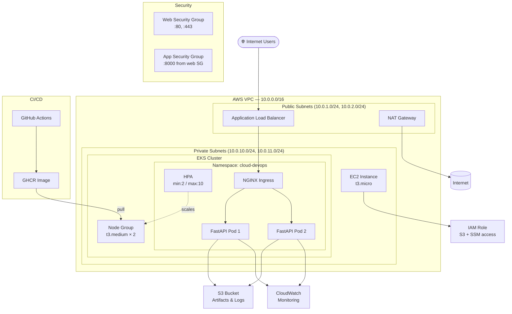
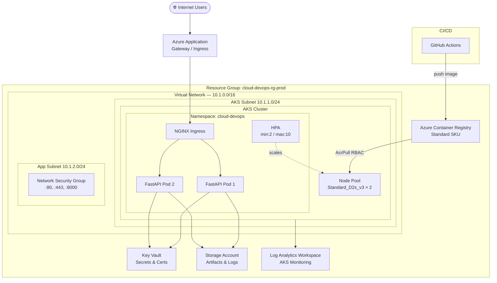
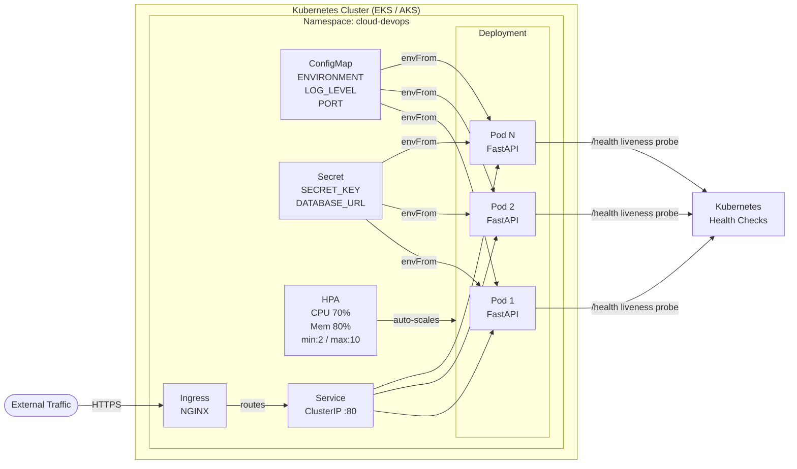

# Architecture Diagrams

## 1. CI/CD Pipeline Flow

```mermaid
flowchart TD
    DEV([👩‍💻 Developer]) -->|git push| GH[GitHub Repository]

    GH -->|triggers| GHA[GitHub Actions]

    subgraph CI ["🔄 CI Stage"]
        GHA --> CHECKOUT[Checkout Code]
        CHECKOUT --> DEPS[Install Dependencies]
        DEPS --> LINT[Lint with flake8]
        LINT --> TEST[Run Unit Tests\npytest + coverage]
        TEST --> REPORT[Upload Coverage Report]
    end

    subgraph BUILD ["🐳 Build & Scan Stage"]
        REPORT --> BUILDX[Docker Buildx\nMulti-platform build]
        BUILDX --> TRIVY[Trivy Security Scan\nCRITICAL + HIGH CVEs]
        TRIVY --> PUSH[Push to GHCR\nghcr.io/your-org/...]
    end

    subgraph DEPLOY_AWS ["☁️ Deploy — AWS EKS"]
        PUSH --> AWS_CREDS[Configure AWS Credentials]
        AWS_CREDS --> EKS_CTX[Update kubeconfig\naws eks update-kubeconfig]
        EKS_CTX --> K8S_AWS[kubectl apply\nnamespace → configmap →\nsecret → deployment →\nservice → ingress → hpa]
        K8S_AWS --> ROLLOUT_AWS[Wait for Rollout\nkubectl rollout status]
    end

    subgraph DEPLOY_AZ ["🌐 Deploy — Azure AKS"]
        PUSH --> AZ_LOGIN[Azure Login\nService Principal]
        AZ_LOGIN --> AKS_CTX[Set AKS Context]
        AKS_CTX --> K8S_AZ[kubectl apply\nAll manifests]
        K8S_AZ --> ROLLOUT_AZ[Wait for Rollout]
    end

    ROLLOUT_AWS --> DONE([✅ Deployment Complete])
    ROLLOUT_AZ --> DONE
```

---

## 2. AWS Deployment Architecture

```mermaid
graph TB
    USERS([🌐 Internet Users]) --> ALB[Application Load Balancer]

    subgraph VPC ["AWS VPC — 10.0.0.0/16"]
        subgraph PUB ["Public Subnets (10.0.1.0/24, 10.0.2.0/24)"]
            ALB
            NAT[NAT Gateway]
        end

        subgraph PRIV ["Private Subnets (10.0.10.0/24, 10.0.11.0/24)"]
            subgraph EKS ["EKS Cluster"]
                NG[Node Group\nt3.medium × 2]
                subgraph NS ["Namespace: cloud-devops"]
                    POD1[FastAPI Pod 1]
                    POD2[FastAPI Pod 2]
                    HPA_AWS[HPA\nmin:2 / max:10]
                    INGRESS_AWS[NGINX Ingress]
                end
            end
            EC2[EC2 Instance\nt3.micro]
        end
    end

    ALB --> INGRESS_AWS
    INGRESS_AWS --> POD1
    INGRESS_AWS --> POD2
    HPA_AWS -.->|scales| NG

    POD1 & POD2 --> S3[S3 Bucket\nArtifacts & Logs]
    POD1 & POD2 --> CW[CloudWatch\nMonitoring]

    EC2 --> IAM[IAM Role\nS3 + SSM access]
    NAT --> INTERNET[(Internet)]

    subgraph CICD ["CI/CD"]
        GHA_AWS[GitHub Actions] --> ECR[GHCR Image]
        ECR -->|pull| NG
    end

    subgraph SECURITY ["Security"]
        SG_WEB[Web Security Group\n:80, :443]
        SG_APP[App Security Group\n:8000 from web SG]
    end
```

---

## 3. Azure Deployment Architecture

```mermaid
graph TB
    USERS([🌐 Internet Users]) --> AGIC[Azure Application\nGateway / Ingress]

    subgraph RG ["Resource Group: cloud-devops-rg-prod"]
        subgraph VNET ["Virtual Network — 10.1.0.0/16"]
            subgraph AKS_SUBNET ["AKS Subnet 10.1.1.0/24"]
                subgraph AKS ["AKS Cluster"]
                    POOL[Node Pool\nStandard_D2s_v3 × 2]
                    subgraph NS_AZ ["Namespace: cloud-devops"]
                        POD_AZ1[FastAPI Pod 1]
                        POD_AZ2[FastAPI Pod 2]
                        HPA_AZ[HPA\nmin:2 / max:10]
                        ING_AZ[NGINX Ingress]
                    end
                end
            end
            subgraph APP_SUBNET ["App Subnet 10.1.2.0/24"]
                NSG[Network Security Group\n:80, :443, :8000]
            end
        end

        ACR[Azure Container Registry\nStandard SKU]
        KV[Key Vault\nSecrets & Certs]
        SA[Storage Account\nArtifacts & Logs]
        LAW[Log Analytics Workspace\nAKS Monitoring]
    end

    AGIC --> ING_AZ
    ING_AZ --> POD_AZ1
    ING_AZ --> POD_AZ2
    HPA_AZ -.->|scales| POOL

    ACR -->|AcrPull RBAC| POOL
    POD_AZ1 & POD_AZ2 --> KV
    POD_AZ1 & POD_AZ2 --> SA
    AKS --> LAW

    subgraph CICD_AZ ["CI/CD"]
        GHA_AZ[GitHub Actions] -->|push image| ACR
    end
```

---

## 4. Kubernetes Resource Flow

```mermaid
flowchart LR
    subgraph CLUSTER ["Kubernetes Cluster (EKS / AKS)"]
        subgraph NS ["Namespace: cloud-devops"]
            CM[ConfigMap\nENVIRONMENT\nLOG_LEVEL\nPORT]
            SEC[Secret\nSECRET_KEY\nDATABASE_URL]

            subgraph DEPLOY ["Deployment"]
                P1[Pod 1\nFastAPI]
                P2[Pod 2\nFastAPI]
                PN[Pod N\nFastAPI]
            end

            HPA[HPA\nCPU 70%\nMem 80%\nmin:2 / max:10]
            SVC[Service\nClusterIP :80]
            ING[Ingress\nNGINX]
        end
    end

    CLIENT([External Traffic]) -->|HTTPS| ING
    ING -->|routes| SVC
    SVC --> P1
    SVC --> P2
    SVC --> PN

    CM -->|envFrom| P1 & P2 & PN
    SEC -->|envFrom| P1 & P2 & PN
    HPA -->|auto-scales| DEPLOY

    P1 & P2 & PN -->|/health liveness probe| PROBE[Kubernetes\nHealth Checks]
```
